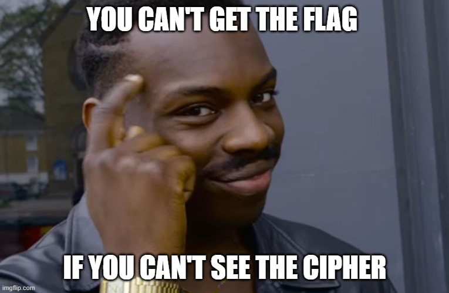

# Invisible Cipher



Note: The Language used as plaintext is English. <br>
:arrow_down:  [dist.zip](dist.zip)

## Solution

This was a basic Frequency analysis challenge and the ciphertext key-space/map was random unicode characters. So,

- Pick up nonsense phrase "ETAOIN SHRDLU" that represents the 12 most frequent letters in typical English language text.
- Check the frequency of each of the letter occurring in the ciphertext
- Start to map them to the the original English Alphabet/map/key-space
- Assume the remaining common english words and totally recover the plaintext + FLAG

### Solve Script: [solve.py](solve.py)
> :beginner: you can uncomment this part in the script to see what's happening
```py
# visualize with
# pt = viz_us(pt)
pt = viz_idx(pt, enc_flag)
```

## Flag
```
wormcon{CAREFUL_FREQUENCY_ANALYSIS_BREAKS_SUBSTITUTION_CIPHER}
```

## Ref
- https://en.wikipedia.org/wiki/Frequency_analysis
